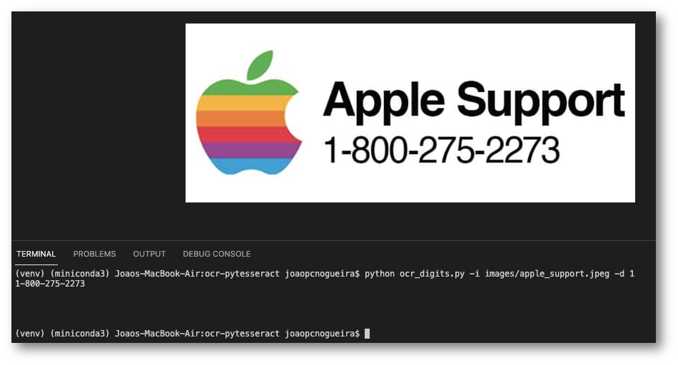

# Optimal Character Recognition with Tesseract and Python

### References
1. [What is Optical Character Recognition (OCR)](https://www.pyimagesearch.com/2021/08/09/what-is-optical-character-recognition-ocr/)

2. [Installing Tesseract, PyTesseract, and Python OCR packages on your system](https://www.pyimagesearch.com/2021/08/16/installing-tesseract-pytesseract-and-python-ocr-packages-on-your-system/)

3. [Your First OCR Project with Tesseract and Python](https://www.pyimagesearch.com/2021/08/23/your-first-ocr-project-with-tesseract-and-python/)

4. [Detecting and OCR’ing Digits with Tesseract and Python](https://www.pyimagesearch.com/2021/08/30/detecting-and-ocring-digits-with-tesseract-and-python/)
